<div align="center">



<br/>

<a href="https://github.com/badhonvitality"></a>
<a href="mailto:badhonvitality@gmail.com"></a>
<a href="#"></a>


<br/><br/>


</div>



## `01` &nbsp;SYSTEM IDENTITY

```ts
const badhon: Developer = {
  role:       "Full-Stack MERN Developer",
  stack:      ["Next.js", "React", "Node.js", "MongoDB", "Express"],
  currently:  "Expanding into AI & Machine Learning",
  learning:   ["Python", "TensorFlow", "C++", "C#"],
  plan:       "Japan 2026 — AI/ML Vocational Studies",
  askMeAbout: ["Web Architecture", "Frontend Perf", "MERN Apps"],
  motto:      "Build it secure. Make it scale. Keep it beautiful.",
};
```

<table>
<tr>
<td width="50%" valign="top">

**`▸` CURRENT DIRECTIVES**

```text
> Architecting production-ready Next.js apps
> Designing robust RESTful APIs with Node
> Integrating AI models into web workflows
```

</td>
<td width="50%" valign="top">

**`▸` OPEN TO**

```text
> Full-stack / Frontend collaborations
> Freelance web development opportunities
> Open source contributions
```

</td>
</tr>
</table>


## `02` &nbsp;TECH ARSENAL

<div align="center">

**`ARCHITECTURE & INTERFACE`**<br/>


<br/><br/>

**`SERVER & DATABASE`**<br/>


<br/><br/>

**`AI / ML EXPLORATION`**<br/>


<br/><br/>

**`DEV ENVIRONMENT`**<br/>


</div>

<br/>


## `03` &nbsp;TELEMETRY & STATS

<div align="center">
  
  
</div>

<div align="center">
  
</div>

<br/>
<p align="center">
  <code>[system] status: online</code> &nbsp;•&nbsp; <code>[system] location: Rangpur, BD</code> &nbsp;•&nbsp; <code>[system] last_sync: ready</code>
</p>
